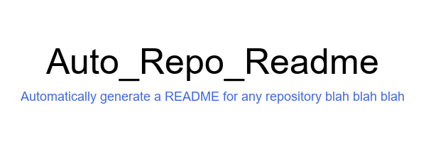

# Auto_Repo_Readme

<!-- At first glance, the branding and messaging clearly conveys what to expect -->

**🤖🔍 Your AI-powered job search assistant. Automate applications, get personalized recommendations, and land your dream job faster.**

Auto_Repo_Readme is a tool that automates the readme creation process in GitHub. Utilizing artificial intelligence, it enables users to make a readme for any GitHub Repository in an automated and professional way.

<!-- Calls to Action here, like join our community/discord/telegram/whatever -->

## Table of Contents

1. [Introduction](#introduction)  <!-- Calls to Action here -->
2. [Features](#features)
3. [Installation](#installation)
4. [Configuration](#configuration)
5. [Usage](#usage)
6. [Documentation](#documentation)
7. [Troubleshooting](#troubleshooting)
8. [Conclusion](#conclusion)
9. [Contributors](#contributors)
10. [License](#license)
11. [Disclaimer](#disclaimer)
